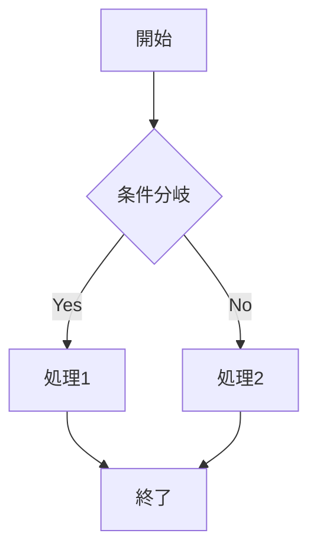
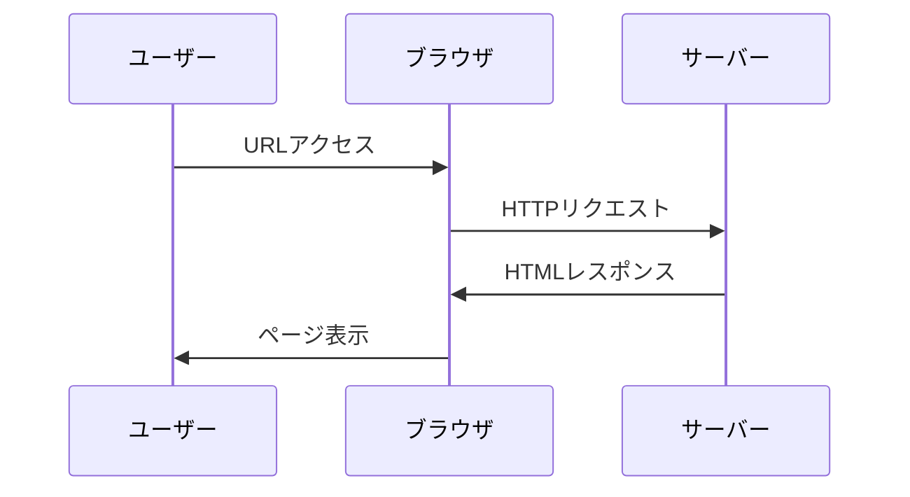
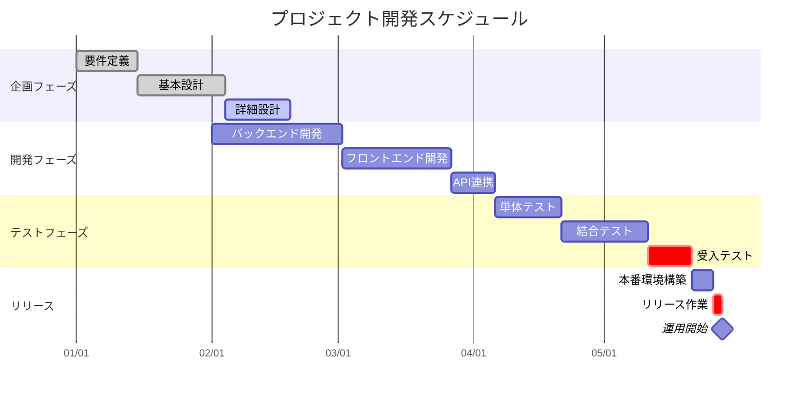

# 最強のマークダウンビューアー デモ

このファイルで各種機能をテストできます。

## 目次

自動で生成される目次により、文書のナビゲーションが簡単になります。

## 基本的なマークダウン要素

### テキストスタイル

- **太字のテキスト**
- *斜体のテキスト*
- ~~取り消し線~~
- `インラインコード`

### リスト

#### 番号なしリスト
- 項目1
  - サブ項目1.1
  - サブ項目1.2
- 項目2
- 項目3

#### 番号付きリスト
1. 最初の項目
2. 二番目の項目
   1. サブ項目2.1
   2. サブ項目2.2
3. 三番目の項目

### 引用

> これは引用文です。
> 複数行にまたがる引用も可能です。
>
> > ネストされた引用も表示できます。

### コードブロック

```javascript
// JavaScriptのコード例
function greet(name) {
    console.log(`こんにちは、${name}さん！`);
}

greet("世界");
```

```python
# Pythonのコード例
def factorial(n):
    if n <= 1:
        return 1
    return n * factorial(n - 1)

print(factorial(5))  # 120
```

## テーブル

| 機能 | 説明 | 状態 |
|------|------|------|
| 目次生成 | 見出しから自動的に目次を作成 | ✅ 実装済み |
| 折りたたみ | セクションの開閉が可能 | ✅ 実装済み |
| ライトボックス | 画像をクリックして拡大表示 | ✅ 実装済み |
| ホットリロード | ファイル変更を自動検知 | ✅ 実装済み |

## Mermaidダイアグラム
aaaaa


### フローチャート



### シーケンス図



### ガントチャート



## 画像

画像をクリックするとライトボックスで拡大表示されます。


## ホットリロード機能

このビューアーの特徴的な機能の一つが、**ホットリロード**です。

1. ファイルをドラッグ&ドロップで開く
2. ヘッダーに表示される更新アイコンをクリック
3. ファイルピッカーから同じファイルを選択
4. これで、エディタでファイルを編集すると自動的に反映されます！

## まとめ

このマークダウンビューアーは以下の特徴を持っています：

- 📋 **自動目次生成** - 文書構造の把握が容易
- 🔽 **折りたたみ機能** - 長い文書でも管理しやすい
- 🖼️ **画像ライトボックス** - 画像の詳細確認が可能
- 📊 **Mermaidサポート** - 図表の表示に対応
- 🔄 **ホットリロード** - リアルタイムプレビュー
- 📱 **レスポンシブデザイン** - どんなデバイスでも快適

---

*このファイルを編集して、ホットリロード機能を試してみてください！*